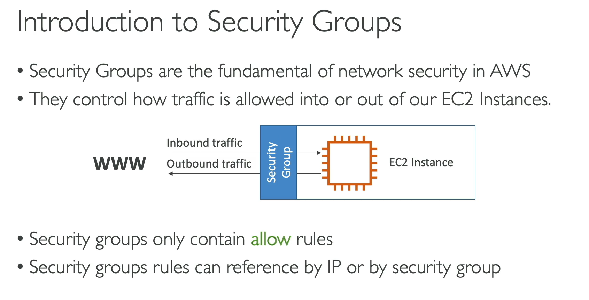
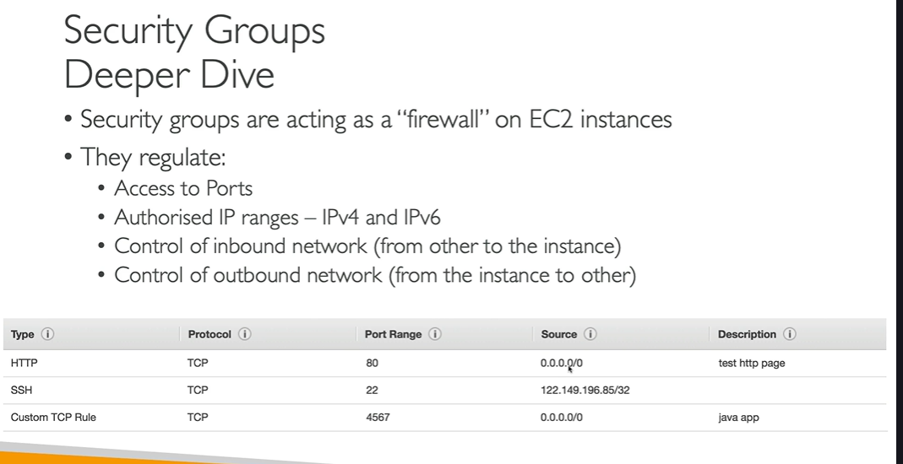
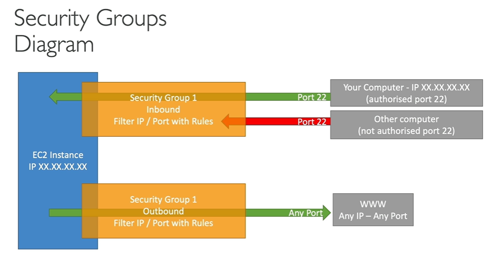
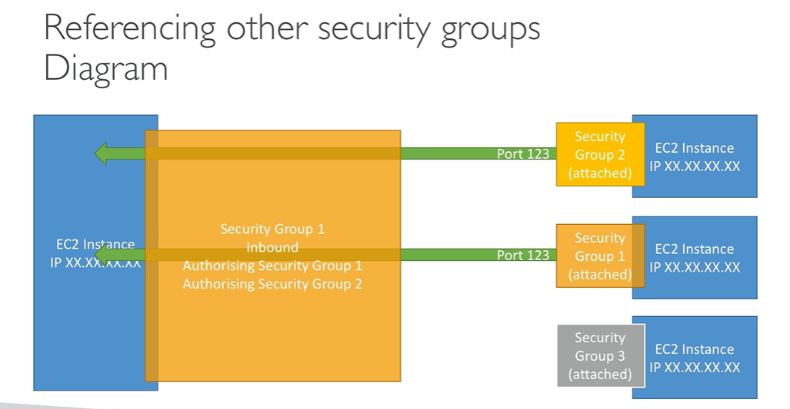

# AWS – Security Groups (Groupes de Sécurité)

## Qu'est-ce qu'un Security Group ?

Un security group est un **pare-feu** autour de vos instances EC2. Il contrôle le trafic entrant (**inbound**) et sortant (**outbound**) et ne contient que des **règles d'autorisation** (allow rules).

Les règles peuvent référencer :

- Des **adresses IP**
- D'autres **security groups**

---

## Structure d'une règle

| Champ        | Description                              |
| ------------ | ---------------------------------------- |
| **Type**     | Type de trafic (ex. SSH, HTTP)           |
| **Protocol** | TCP, UDP, etc.                           |
| **Port**     | Port autorisé                            |
| **Source**   | Plage d'IP (`0.0.0.0/0` = tout le monde) |

---

## Comportement par défaut

- Tout le trafic **entrant** est **bloqué**
- Tout le trafic **sortant** est **autorisé**

---

## Diagnostic des erreurs

| Symptôme                                       | Cause                                  |
| ---------------------------------------------- | -------------------------------------- |
| **Timeout** (la connexion attend indéfiniment) | Problème de security group             |
| **Connection refused** (réponse reçue)         | Security group OK, problème applicatif |

---

## Bonnes pratiques

- Un security group peut être attaché à **plusieurs instances**, et une instance peut avoir **plusieurs security groups**
- Les security groups sont liés à une **région / VPC** — à recréer si vous changez de région ou de VPC
- Le security group est **externe** à l'instance EC2 : le trafic bloqué n'atteint jamais l'instance
- Créer un security group **dédié au SSH** pour simplifier la gestion

---

## Référencer un Security Group depuis un autre

Il est possible d'autoriser le trafic entrant en référençant un autre security group (au lieu d'une IP).

**Exemple :**

- SG-1 autorise en inbound : SG-2 et SG-3
- Toute instance avec SG-2 ou SG-3 peut communiquer avec l'instance SG-1, **peu importe son IP**
- Une instance avec SG-4 (non autorisé) sera bloquée

> Très utile avec les **load balancers** — évite de gérer des IPs manuellement.

---

## Ports importants à connaître

| Port     | Protocole  | Usage                                            |
| -------- | ---------- | ------------------------------------------------ |
| **22**   | SSH / SFTP | Connexion Linux / transfert de fichiers sécurisé |
| **21**   | FTP        | Transfert de fichiers non sécurisé               |
| **80**   | HTTP       | Sites web non sécurisés                          |
| **443**  | HTTPS      | Sites web sécurisés (standard actuel)            |
| **3389** | RDP        | Connexion à une instance Windows                 |
