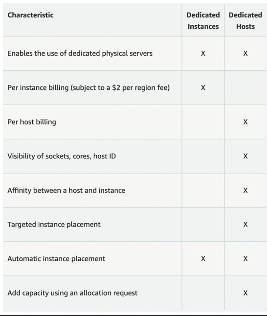
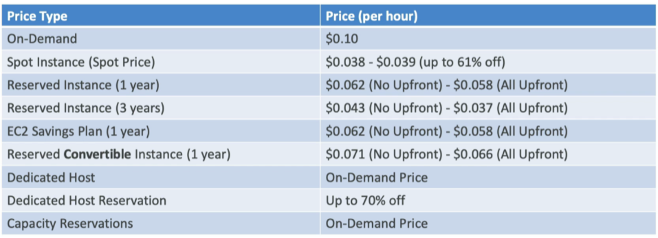

# AWS – EC2 : Options d'Achat

## Vue d'ensemble

| Option                   | Durée                | Remise      | Cas d'usage                   |
| ------------------------ | -------------------- | ----------- | ----------------------------- |
| **On-Demand**            | Court terme          | Aucune      | Workloads imprévisibles       |
| **Reserved**             | 1 ou 3 ans           | Jusqu'à 72% | Workloads stables (ex. DB)    |
| **Savings Plan**         | 1 ou 3 ans           | Jusqu'à 70% | Workloads longs et flexibles  |
| **Spot**                 | Court terme          | Jusqu'à 90% | Workloads interruptibles      |
| **Dedicated Host**       | On-demand ou 1/3 ans | Variable    | Licences, conformité          |
| **Dedicated Instance**   | On-demand            | Variable    | Hardware dédié                |
| **Capacity Reservation** | Toute durée          | Aucune      | Capacité garantie dans une AZ |

---

## Détail de chaque option

### 🔵 On-Demand

- Facturation à la **seconde** (Linux/Windows) ou à l'**heure** (autres OS)
- Pas d'engagement, pas de paiement anticipé
- Coût le plus élevé
- Idéal pour les **workloads courts et imprévisibles**

---

### 🟢 Reserved Instances

- **72% de remise** vs On-Demand
- Engagement sur les attributs : type d'instance, région, OS, tenancy
- Période : **1 an** ou **3 ans** (plus long = plus de remise)
- Paiement : tout upfront > partiel > aucun
- Scope : régional ou par AZ (réserve de capacité)
- Achat/revente possible sur le **marketplace**
- Idéal pour les applications à usage **stable et prévisible** (ex. base de données)

**Variante — Convertible Reserved Instance :**

- Permet de changer le type d'instance, l'OS, la tenancy en cours de route
- Remise légèrement inférieure : jusqu'à **66%**

---

### 🟢 Savings Plan

- **70% de remise** — même niveau que Reserved
- Engagement sur un **montant de dépense** (ex. 10 $/heure pendant 1 ou 3 ans)
- Flexible sur : la taille d'instance, l'OS, la tenancy
- Verrouillé sur : la **famille d'instance** et la **région** (ex. M5 en us-east-1)
- Tout usage au-delà du plan → facturé au tarif On-Demand

---

### 🔴 Spot Instances

- Jusqu'à **90% de remise** — l'option la moins chère
- Vous définissez un **prix maximum** à payer
- Si le prix spot dépasse votre max → **l'instance est perdue**
- ✅ Adapté à : batch jobs, analyse de données, traitement d'images, workloads distribués
- ❌ Non adapté à : bases de données, jobs critiques

---

### ⚫ Dedicated Host

- Réservation d'un **serveur physique entier**
- Nécessaire pour les **licences liées au hardware** (per-socket, per-core, BYOL)
- Utile pour les exigences **réglementaires ou de conformité**
- Facturation : On-Demand (par seconde) ou réservé 1/3 ans
- Option la **plus coûteuse** d'AWS

---

---

### ⚫ Dedicated Instance

- Hardware dédié à votre compte, mais **pas un serveur physique entier**
- Peut partager le hardware avec d'autres instances **du même compte**
- Pas de contrôle sur le placement des instances

> **Différence clé :** Dedicated Instance = hardware dédié / Dedicated Host = serveur physique + visibilité bas niveau

---

### 🟡 Capacity Reservation

- Réserve de la capacité dans une **AZ spécifique**, sans engagement de durée
- Annulable à tout moment
- **Aucune remise** — tarif On-Demand même si l'instance ne tourne pas
- Pour obtenir des remises : combiner avec Reserved Instances ou Savings Plan
- Idéal pour les workloads courts mais qui **doivent absolument démarrer** dans une AZ donnée

---

## L'analogie du Resort 🏨

| Option                   | Analogie                                                                             |
| ------------------------ | ------------------------------------------------------------------------------------ |
| **On-Demand**            | Vous arrivez quand vous voulez, payez plein tarif                                    |
| **Reserved**             | Vous réservez longtemps à l'avance → bon prix garanti                                |
| **Savings Plan**         | Vous vous engagez à dépenser X€/mois → flexibilité sur la chambre                    |
| **Spot**                 | Chambres inoccupées à prix cassé, mais vous pouvez être expulsé                      |
| **Dedicated Host**       | Vous réservez tout le bâtiment                                                       |
| **Capacity Reservation** | Vous bloquez une chambre sans certitude de l'utiliser, mais vous la payez quand même |

---

## Comparatif de prix (exemple m4.large, us-east-1)

| Option                       | Remise estimée       |
| ---------------------------- | -------------------- |
| On-Demand                    | référence (0%)       |
| Spot                         | ~61%                 |
| Reserved 1 an (no upfront)   | remise modérée       |
| Reserved 1 an (all upfront)  | remise maximale      |
| Reserved 3 ans (all upfront) | remise maximale      |
| Savings Plan                 | ~même que Reserved   |
| Convertible Reserved         | légèrement moins     |
| Dedicated Host Reservation   | jusqu'à 70%          |
| Capacity Reservation         | 0% (tarif On-Demand) |

